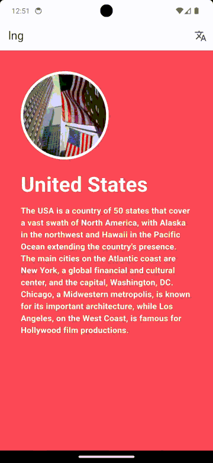

# lng


[](https://github.com/carllosnc/lng/actions/workflows/dart.yml)
[](https://app.codacy.com/gh/carllosnc/lng/dashboard?utm_source=gh&utm_medium=referral&utm_content=&utm_campaign=Badge_grade)

>A Flutter package to manage language translations.

| Example                           |
| --------------------------------- |
|  |

## Install

This is a unpublished package it means that the package is not yet published on pub.dev.

```yaml
dependencies:
  vw:
    git:
      url: https://github.com/carllosnc/lng.git
```

To more information about unpublished packages see: https://dart.dev/tools/pub/package-layout#unpublished-packages

## 01: Initial configuration

The first step is to initialize the package.

- `lngCore`: is responsible for the initialization of the package.
- `lng.addLabels`: is the method that add the translations.

```dart
import 'package:lng/lng.dart';

void main() {
  lngCore.init(defaultLang: 'en');
  lng.addLabels({
    'en': {
      'es': 'Spanish',
      'en': 'English',
      'text': 'Hello World',
      'color': Colors.red,
      'app_title': 'App title'
    },
    'es': {
      'es': 'Español',
      'en': 'Inglés',
      'text': 'Hola Mundo',
      'color': Colors.orange
      'app_title': 'Título de la app'
    },
  });

  //event listener for language change
  lng.onLangChange = (String language) {
    log('Language changed to $language');
  };
}
```

## 02: Use LngMixin and call lng.get()

`LngMixin` use `ChangeNotifier` to notify the listeners when the language changes,
each widget that call `lng.get()` must be using `LngMixin`.

```dart
import 'package:flutter/material.dart';
import 'package:lng/lng.dart';

class Home extends StatefulWidget {
  const Home({
    super.key,
  });

  @override
  State<Home> createState() => _HomeState();
}

class _HomeState extends State<Home> with LngMixin {
  @override
  Widget build(BuildContext context) {
    return Scaffold(
      backgroundColor: lng.get('color'),
      appBar: AppBar(
        title: Text(lng.get('app_title')),
      ),
      body: Column(
        children: [
          Text(lng.get('text')),
        ],
      ),
    );
  }
}
```

## 03: Call openLng()

`openLng` is a function that open a dialog to select the language.

```dart
IconButton(
  icon: const Icon(Icons.translate),
  onPressed: () {
    openLng(
      context: context,
      title: "Set language",
    );
  },
),
```

**Parameters**

| Parameter         | Type           | Description                                                     |
| ----------------- | -------------- | --------------------------------------------------------------- |
| `context`         | `BuildContext` | The context to open the modal bottom sheet in.                  |
| `title`           | `String`       | The title of the modal bottom sheet.                            |
| `titleStyle`      | `TextStyle?`   | The style of the title of the modal bottom sheet.               |
| `backgroundColor` | `Color?`       | The background color of the modal bottom sheet.                 |
| `borderRadius`    | `double`       | Top left and top right border radius of the modal bottom sheet. |

## lng.onLangChange

`lng.onLangChange` is a function that is called when the language changes.

| Parameter  | Type     | Description                            |
| ---------- | -------- | -------------------------------------- |
| `language` | `String` | The language code that was changed to. |

```dart
lng.onLangChange = (String language) {
  log('Language changed to $language');
};
```

---

Carlos Costa @ 2024
